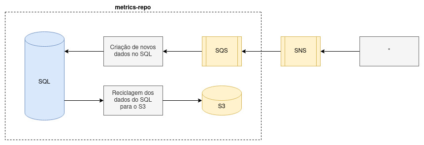

## [Desenvolvimento] Metrics Repo

### Proposta do Projeto

Em suma, este projeto foi criado com o intuito de fornecer um sistema de consolidação de métricas. Como pode-se notar no design apresentado, foram criadas duas aplicações. Sendo a primeira delas, um deploy responsável por armazenar os dados recuperados de uma fila SQS em uma tabela SQL. Enquanto a segunda aplicação é um cron, que tem como função regularmente revisar os dados armazenados na tabela SQL, e os mover para arquivos persistidos em um Bucket S3.

